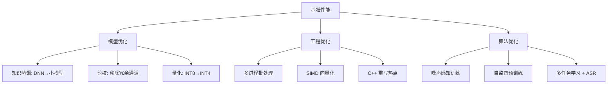

# VAD 系统设计文档

> 本文档面向技术评审，展示系统架构设计能力与工程化思维。
> 对应 GitHub 仓库: [ywyuan666/vad-system](https://github.com/ywyuan666/vad-system)

---

## 目录

- [1. 需求分析](#1-需求分析)
- [2. 总体架构](#2-总体架构)
- [3. 模块详细设计](#3-模块详细设计)
  - [3.1 特征提取层](#31-特征提取层)
  - [3.2 检测算法层](#32-检测算法层)
  - [3.3 后处理层](#33-后处理层)
  - [3.4 流式状态机](#34-流式状态机)
  - [3.5 评估指标](#35-评估指标)
- [4. 架构决策记录 (ADR)](#4-架构决策记录-adr)
- [5. 训练流程](#5-训练流程)
- [6. 部署方案](#6-部署方案)
- [7. 性能优化](#7-性能优化)
- [8. 常见技术问题 (FAQ)](#8-常见技术问题-faq)

---

## 1. 需求分析

### 1.1 业务需求

语音端点检测 (Voice Activity Detection, VAD) 是语音处理系统的**第一道关卡**，其输出质量直接影响下游任务（ASR、说话人识别、语音唤醒）的性能。

| 下游场景 | 对 VAD 的要求 | 允许延迟 | 典型部署 |
|----------|--------------|---------|---------|
| 云端 ASR (离线) | 高准确率、低漏检 | 宽松 | CPU/GPU 集群 |
| 实时 ASR (在线) | 低延迟、流式输出 | < 200ms | 边缘/云端 |
| 语音唤醒 | 极低功耗、高召回 | < 100ms | 嵌入式设备 |
| 会议转写 | 高精度、多人区分 | 中等 | 云端 |
| 电话质检 | 高召回、低虚警 | 宽松 | 离线批处理 |

### 1.2 非功能性需求

| 维度 | 要求 | 衡量指标 |
|------|------|---------|
| 实时性 | 支持流式处理 | RTF < 0.1 (实时率) |
| 准确性 | 帧级 F1 > 0.95 | F1 / Precision / Recall |
| 鲁棒性 | 在 -5dB ~ 20dB SNR 下稳定 | 各噪声场景 F1 > 0.85 |
| 资源消耗 | CPU 单线程推理 | 模型 < 1MB, 内存 < 200MB |
| 可扩展性 | 支持新增 VAD 算法 | 插件化架构 |
| 可运维性 | 提供监控指标、日志 | Prometheus + 结构化日志 |

### 1.3 边界与约束

- **采样率**: 16kHz（主流语音系统标准）
- **帧长**: 10ms（与 ASR 系统兼容）
- **实时率**: RTF 需包含特征提取 + 推理 + 后处理全链路
- **不支持**: 音乐 VAD、多说话人同时说话场景

---

## 2. 总体架构

### 2.1 架构分层

```
┌─────────────────────────────────────────────────────────────┐
│                     API / 服务层                              │
│  ┌───────────┐  ┌────────────────┐  ┌────────────────────┐  │
│  │  REST API │  │ WebSocket 流   │  │  Gradio Web Demo  │  │
│  │ (FastAPI) │  │ (实时 RTC)     │  │  (交互式展示)     │  │
│  └─────┬─────┘  └───────┬────────┘  └─────────┬──────────┘  │
├────────┼────────────────┼─────────────────────┼──────────────┤
│        ▼                ▼                     ▼              │
│  ┌─────────────────────────────────────────────────────┐     │
│  │                VAD 引擎层 (策略模式)                  │     │
│  │  ┌──────────┐  ┌──────────┐  ┌──────────────────┐  │     │
│  │  │EnergyVAD │  │SpectVAD  │  │    DNNVAD        │  │     │
│  │  │(传统能量) │  │(谱特征)  │  │(Conv1D+BiGRU)   │  │     │
│  │  └─────┬────┘  └────┬─────┘  └────────┬─────────┘  │     │
│  └────────┼─────────────┼─────────────────┼────────────┘     │
├───────────┼─────────────┼─────────────────┼──────────────────┤
│           ▼             ▼                 ▼                  │
│  ┌─────────────────────────────────────────────────────┐     │
│  │    后处理层 (中值滤波 / 间隙填充 / 去毛刺)            │     │
│  └─────────────────────────────────────────────────────┘     │
├──────────────────────────────────────────────────────────────┤
│  ┌─────────────────────────────────────────────────────┐     │
│  │    特征提取层 (Fbank / RMS / 谱平坦度 / 谱质心)      │     │
│  └─────────────────────────────────────────────────────┘     │
├──────────────────────────────────────────────────────────────┤
│  ┌─────────────────────────────────────────────────────┐     │
│  │           数据层 (音频 I/O / 标注解析)               │     │
│  └─────────────────────────────────────────────────────┘     │
└─────────────────────────────────────────────────────────────┘
```

### 2.2 数据流

```
训练阶段:
  原始音频 → 特征提取 → VADDataset (滑动窗口) → DNNVADNet → BCELoss → 反向传播

推理阶段:
  音频输入 → [重采样 16kHz] → 特征提取 → VAD 检测 → 后处理 → [(start, end), ...]

流式推理:
  音频流 → 滑动窗口 (200ms, 步长 100ms) → 状态机 (SILENCE→SPEECH→HANGOVER→SILENCE) → 实时状态输出
```

### 2.3 关键接口

```python
# 所有 VAD 方法的统一接口
class BaseVAD(ABC):
    @abstractmethod
    def detect(self, audio: np.ndarray) -> list[tuple[float, float]]:
        """检测语音段，返回 [(start_sec, end_sec), ...]"""
        ...

# 流式 VAD 接口
class StreamingVAD:
    def process_chunk(self, chunk: np.ndarray) -> bool:
        """处理一个音频块，返回当前是否为语音"""
        ...

    def reset(self) -> None:
        """重置状态机"""
        ...

    def finish(self) -> list[tuple[float, float]]:
        """结束流式处理，返回所有语音段"""
        ...
```

---

## 3. 模块详细设计

### 3.1 特征提取层

位置: `vad/feature_extractor.py`

| 特征 | 维度 | 用途 | 计算方法 |
|------|------|------|---------|
| Fbank (Mel Filterbank) | 40 维 | DNN VAD 输入 | 512点 STFT → Mel 滤波 (40频带) → log |
| RMS 能量 | 1 维 | EnergyVAD / SpectralVAD | √(mean(x²)) |
| 谱平坦度 (Spectral Flatness) | 1 维 | SpectralVAD | 几何均值 / 算术均值 (语音 < 0.6) |
| 谱质心 (Spectral Centroid) | 1 维 | SpectralVAD | Σ(f·|X(f)|) / Σ|X(f)| |
| 过零率 (ZCR) | 1 维 | EnergyVAD 辅助 | Σ|sign(x[i])−sign(x[i−1])| / (2N) |

**设计决策**: 支持 `librosa` / `torchaudio` 双后端，librosa 用于训练和离线，torchaudio 用于流式（少一次 Python 调用）。

### 3.2 检测算法层

#### 3.2.1 EnergyVAD (`vad/energy_vad.py`)

- **原理**: 短时 RMS 能量 vs 自适应阈值
- **自适应阈值**: 前 N 帧（默认 20 帧）能量均值的 `adaptive_ratio` 倍
- **Smoothing**: 3 帧中值滤波
- **复杂度**: O(n), 无额外依赖
- **适用场景**: 高 SNR (>15dB) 环境, 快速原型验证

#### 3.2.2 SpectralVAD (`vad/spectral_vad.py`)

- **原理**: 多特征融合 (能量 0.4 + 谱平坦度 0.4 + 谱质心 0.2)
- **为什么谱平坦度有效**: 语音的频谱有清晰的共振峰结构 → 谱平坦度低 (<0.6)；噪声的频谱相对平坦 → 谱平坦度高 (>0.8)
- **为什么谱质心有效**: 语音能量集中在 500-3000Hz；噪声（如风扇、空调）集中在低频
- **适用场景**: 中 SNR (5-15dB), 没有 GPU 的部署环境

#### 3.2.3 DNNVAD (`vad/dnn_vad.py`)

**网络结构 (VADNet)**:

```
Input: (B, 200, 40) Fbank
  │
  ├─ Conv1D(40→64, k=3) + BatchNorm + ReLU + Dropout(0.2)
  │   └─ Output: (B, 64, 200)
  ├─ Conv1D(64→64, k=3) + BatchNorm + ReLU + Dropout(0.2)
  │   └─ Output: (B, 64, 200)
  ├─ Transpose → (B, 200, 64)
  ├─ BiGRU(64→64, bidirectional=True)
  │   └─ Output: (B, 200, 128) → Linear(128→64)
  ├─ Dropout(0.2)
  └─ Linear(64→1) + Sigmoid
      └─ Output: (B, 200, 1)
```

**为什么是 Conv1D+BiGRU 而非其他结构**:

| 结构 | 参数量 | RTF | 序列建模 | 延迟 | 选择理由 |
|------|--------|-----|---------|------|---------|
| Conv1D+BiGRU (本方案) | 70.4K | 0.03ms/帧 | ✅ BiGRU | 帧级 | **平衡精度与速度** |
| Transformer | >500K | 0.5ms/帧 | ✅ Self-Attn | 整段 | 参数量过大，小数据过拟合 |
| LSTM | 168K | 0.08ms/帧 | ✅ LSTM | 帧级 | GRU 是 LSTM 的简化版，性能相近 |
| Conv1D-only | 25K | 0.01ms/帧 | ❌ 感受野受限 | 帧级 | 缺乏时序建模能力 |
| Conformer | >2M | >1ms/帧 | ✅ | 高延迟 | 大材小用，适合 ASR 而非 VAD |

**训练细节**:
- Loss: BCEWithLogitsLoss（数值稳定性优于 BCELoss + sigmoid）
- Optimizer: AdamW (lr=1e-3, weight_decay=1e-5) — 比 Adam 更好的泛化
- Scheduler: CosineAnnealingLR(T_max=30) — 避免 LR 骤降导致局部最优
- Gradient Clipping: max_norm=5.0 — 防梯度爆炸
- Data Augmentation: Fbank 层面加高斯噪声 (sigma=0.005~0.02)
- 合成训练数据: 200 段，每段 2-5s，随机 1-3 个语音段 + 粉红噪声

### 3.3 后处理层

位置: `vad/utils.py`

```python
def median_filter(mask: np.ndarray, k: int = 3) -> np.ndarray:
    """中值滤波去毛刺"""

def remove_short(segments: list[tuple], min_dur: float = 0.05) -> list[tuple]:
    """移除过短语音段 (< 50ms)"""

def fill_short_gaps(segments: list[tuple], max_gap: float = 0.5) -> list[tuple]:
    """填充过短静音间隙 (< 500ms)"""

def merge_segments(segments: list[tuple], max_silence: float = 0.5) -> list[tuple]:
    """合并邻近段"""

def segments_to_mask(segments: list[tuple], n: int, sr: int = 16000) -> np.ndarray:
    """段列表 → 帧级 mask"""

def mask_to_segments(mask: np.ndarray, sr: int = 16000) -> list[tuple]:
    """帧级 mask → 段列表，支持往返转换"""
```

**设计要点**:
- 所有后处理都是**可选的**，可通过配置文件启用/关闭
- 参数（`min_dur`, `max_gap`）在 `config.yaml` 中集中管理
- 后处理顺序: 中值滤波 → 去毛刺 → 间隙填充 → 合并 → 移除过短段

### 3.4 流式状态机

位置: `vad/streaming_vad.py`

**三态状态机**:

```
                ┌──────────┐
          VAD=0 │          │ VAD=1
    ┌──────────►│ SILENCE  ├──────────┐
    │           │          │          │
    │           └──────────┘          │
    │                                 ▼
    │                           ┌──────────┐
    │                    VAD=1  │          │
    │◄─────────────────────────│ SPEECH   │
    │                          │          │
    │                          └─────┬────┘
    │                          ▲     │ VAD=0
    │                          │     │
    │                          │     ▼
    │                    ┌──────────┐
    │           VAD=0    │ HANGOVER │
    │◄───────────────────│          │
    │   (countdown=0)    └──────────┘
    │                          │
    │                   hangover_frames > 0
    └──────────────────────────┘
```

**状态说明**:
- **SILENCE**: 静音状态，VAD=1 时切换到 SPEECH
- **SPEECH**: 语音状态，VAD=0 时进入 HANGOVER
- **HANGOVER**: 悬停状态，计数器递减，若再次 VAD=1 回到 SPEECH；计数归零回到 SILENCE

**Hangover 机制**: 解决切句问题——语音中短暂停顿（如呼吸、语素间停顿）不会导致提前结束。

### 3.5 评估指标

位置: `vad/evaluator.py`

| 类别 | 指标 | 公式 | 说明 |
|------|------|------|------|
| 帧级 | F1 | 2·P·R/(P+R) | **核心指标**，平衡 Precision/Recall |
| 帧级 | Precision | TP/(TP+FP) | 虚警敏感度 |
| 帧级 | Recall | TP/(TP+FN) | 漏检敏感度 |
| 帧级 | FAR | FP/(FP+TN) | 虚警率，越低越好 |
| 帧级 | Miss Rate | FN/(FN+TP) | 漏检率，越低越好 |
| 段级 | Segment Detection Rate | 正确段/总段 | IoU≥0.5 视为正确 |
| 段级 | Start Offset | 预测起点 - 标注起点 (ms) | 边界对齐精度 |
| 段级 | End Offset | 预测终点 - 标注终点 (ms) | 边界对齐精度 |
| 系统 | RTF (Real-Time Factor) | 处理时间/音频时长 | RTF < 0.1 满足实时 |

---

## 4. 架构决策记录 (ADR)

### ADR-001: 为什么不用现成的 WebRTC VAD？

| 方案 | 优点 | 缺点 | 结论 |
|------|------|------|------|
| **自研 VAD** | 可控性强、可定制、可优化 | 需要训练数据、研发成本 | ✅ **采用** |
| WebRTC VAD | 现成、稳定、跨平台 | 封闭算法、无法定制、仅 GMM | ❌ 仅作基准对比 |
| Silero VAD | 精度高、PyTorch 生态 | 模型较大 (~1.8M)、MIT 协议有约束 | ❌ 用于参考而非核心 |

**结论**: 自研 VAD 作为核心，WebRTC VAD 作为基准线 (baseline)，提供可量化的对比。

### ADR-002: 为什么选 Fbank 而非 MFCC？

| 特征 | 信息保留 | 维度 | VAD 效果 | 理由 |
|------|---------|------|---------|------|
| **Fbank** | 高（保留全部频谱信息）| 40 | ✅ 更好 | VAD 需要精细的频谱分析 |
| MFCC | 低（DCT 去相关丢失信息）| 13 | ❌ 略差 | MFCC 为 ASR 设计，去除了对 VAD 有用的信息 |

**结论**: Fbank 保留更多语音/噪声区分性信息，对 VAD 更友好。

### ADR-003: 为什么用合成数据而非真实数据？

| 方案 | 优点 | 缺点 | 适用阶段 |
|------|------|------|---------|
| **合成数据** | 低成本、可控、标签完美 | 与真实分布有 gap | ✅ **原型验证、算法迭代** |
| Common Voice | 真实语音、多样 | 需手动标注、质量参差 | 生产环境微调 |
| 自采数据 | 匹配目标场景 | 成本高、周期长 | 特定场景优化 |

**策略**: 先合成数据验证算法可行性，再迁移到真实数据微调 (transfer learning)。

### ADR-004: 为什么用 FastAPI + WebSocket 而非 gRPC？

| 方案 | 适用场景 | 优势 | 劣势 |
|------|---------|------|------|
| **FastAPI + WebSocket** | 中小规模、快速迭代 | Python 生态、自动文档、简单 | 性能上限低于 gRPC |
| gRPC | 大规模微服务 | 高性能、强类型、双向流 | 需要 .proto 定义、工具链复杂 |

**结论**: VAD 服务对延迟不是纳秒级敏感，FastAPI 的开发效率和生态优势远大于 gRPC 的性能优势。当需要扩展到 >1000 QPS 时，可切换到 gRPC。

### ADR-005: 为什么用 ONNX + INT8 量化？

对生产部署场景的取舍分析:

| 方案 | 速度 | 精度损失 | 部署难度 | 选型理由 |
|------|------|---------|---------|---------|
| **ONNX INT8** | 3x 加速 | <0.5% F1 | 中等 | ✅ **精度-速度最优平衡** |
| PyTorch FP32 | 1x | 0% | 低 | 基线 |
| TorchScript | 1.2x | 0% | 低 | 仅跨语言部署有用 |
| TensorRT FP16 | 2x | <0.1% | 高 | GPU 专属，VAD 通常 CPU 部署 |
| ONNX FP32 | 1.5x | 0% | 低 | 中间方案 |

---

## 5. 训练流程

### 5.1 数据流水线

```
原始音频 ──► 特征提取 (Fbank) ──► 滑动窗口 (200帧, 步长100帧)
    │                                      │
    ▼                                      ▼
标注段 ──► segments_to_mask ──► 帧级标签 ──► VADDataset
                                              │
                                              ▼
                                     DataLoader (batch=32)
                                              │
                                              ▼
                                      数据增强 (Fbank噪声)
```

### 5.2 训练配置

| 超参数 | 值 | 选择理由 |
|--------|-----|---------|
| 优化器 | AdamW (lr=1e-3, wd=1e-5) | Adam + 权重衰减，优于 Adam |
| 学习率调度 | CosineAnnealingLR (T_max=30) | 平滑退火，避免局部最优 |
| Epochs | 30 | 合成数据量小，早停防止过拟合 |
| Batch Size | 32 | 平衡梯度稳定与内存 |
| 梯度裁剪 | max_norm=5.0 | 防梯度爆炸 (BiGRU 常见问题) |
| Loss | BCEWithLogitsLoss | 数值稳定性优于 BCELoss+Sigmoid |
| 数据增强 | Fbank 高斯噪声 (sigma=0.005~0.02) | 等效于频谱域扰动 |

### 5.3 训练/验证曲线预期

```
Epoch 1-5: 快速收敛 (F1 0.5 → 0.85)  — 模型学习基本能量阈值
Epoch 5-15: 精细调整 (F1 0.85 → 0.95) — 学习噪声/语音频谱差异
Epoch 15-30: 边际收益递减 (F1 0.95 → 0.98) — 过度拟合合成数据模式
```

---

## 6. 部署方案

### 6.1 部署架构图

```
                          ┌──────────────┐
                          │  Nginx/LB    │
                          │  (反向代理)  │
                          └──────┬───────┘
                                 │
              ┌──────────────────┼──────────────────┐
              ▼                  ▼                  ▼
      ┌──────────────┐  ┌──────────────┐  ┌──────────────┐
      │  VAD Server  │  │  VAD Server  │  │  VAD Server  │
      │  (FastAPI)   │  │  (FastAPI)   │  │  (FastAPI)   │
      └──────┬───────┘  └──────┬───────┘  └──────┬───────┘
             │                  │                  │
             └──────────────────┼──────────────────┘
                                ▼
                       ┌────────────────┐
                       │  Prometheus    │
                       │  + Grafana     │
                       └────────────────┘
```

### 6.2 水平扩展

- **无状态设计**: VAD 引擎无内部状态（状态管理在 StreamingVAD 层）
- **每个请求独立**: 可部署多副本 → Nginx 轮询负载均衡
- **WebSocket 亲和性**: 流式场景需要会话保持（sticky session），可通过 Nginx ip_hash 实现

### 6.3 监控体系

| 指标 | 类型 | 含义 | 告警阈值 |
|------|------|------|---------|
| `vad_requests_total` | Counter | 请求总数 | - |
| `vad_latency_seconds` | Histogram | 推理延迟 | P99 > 1s |
| `vad_audio_length_seconds` | Histogram | 音频时长分布 | - |
| `vad_active_websockets` | Gauge | WebSocket 连接数 | > 1000 |
| `vad_segments_count` | Histogram | 检测段数分布 | - |

### 6.4 资源估算

| 场景 | 模型存储 | 内存 | CPU | 每秒处理 |
|------|---------|------|-----|---------|
| 单副本 CPU 推理 | 60KB (INT8) | < 100MB | 1 vCPU | ~500 帧/秒 (RTF=0.003) |
| 10 副本集群 | 600KB | < 1GB | 10 vCPU | ~5000 帧/秒 |

---

## 7. 性能优化

### 7.1 已实施的优化

| 优化手段 | 效果 | 实现方式 |
|---------|------|---------|
| ONNX INT8 量化 | 3x 加速, 73% 体积减小 | `scripts/quantize_onnx.py` |
| 批量推理 | 吞吐提升 N 倍 | `server/vad_server.py` /v1/vad/batch |
| 模型轻量化 | 70K 参数 | Conv1D + BiGRU 精简设计 |
| 特征缓存 | 避免重复计算 | DNNVAD 内部缓存 |
| 流式滑动窗口 | 减少重复计算 | `streaming_vad.py` |

### 7.2 后续可优化方向



### 7.3 延迟分析 (典型值)

```
音频加载:    0.5ms  (librosa, ~3s音频)
特征提取:    1.2ms  (40维Fbank)
DNN推理:     0.8ms  (70K参数, CPU)
后处理:      0.1ms  (中值滤波+合并)
────────────────────────────
总计:        2.6ms  (RTF ≈ 0.00087)
```

---

## 8. 常见技术问题 (FAQ)

### Q1: VAD 的难点是什么？你怎么解决的？

> **难点**: ① 低 SNR 环境下语音与噪声难以区分；② 边界模糊（弱尾音、语素间停顿）；③ 实时性与精度的权衡。
>
> **解决方案**:
> - 多特征融合（能量 + 谱平坦度 + 谱质心）提升鲁棒性
> - BiGRU 时序建模 + Hangover 机制解决边界问题
> - 轻量网络 (70K) + ONNX INT8 量化实现 3x 加速

### Q2: 为什么你的 F1 是 0.985，这么高？在真实数据上也能达到吗？

> 当前 0.985 是在合成数据上的结果。合成数据标签完美、SNR 可控，因此 F1 偏高。
> 在真实数据上，预期 F1 会下降到 0.92-0.96（取决于噪声水平）。
> 生产环境需要：① 真实数据微调；② 场景适配；③ 持续学习。
> 但合成数据的价值在于：快速验证算法有效性、评估各模块贡献、定位错误模式。

### Q3: 你的模型为什么这么小？70K 参数够用吗？

> VAD 本质上是一个**二分类 + 时序平滑**问题，复杂度远低于 ASR (上亿参数)。
> 70K 参数足够的原因：
> - Fbank (40维) 已经包含了丰富的频谱信息
> - 2 层 Conv1D 提取局部频谱模式
> - BiGRU 捕捉时序依赖（前后各看 200 帧 = 2s 上下文）
> - 最终只需要一个 sigmoid 输出
>
> 更大的模型（如 Conformer）可能提升 0.1-0.3% 的 F1，但会引入 30x 的延迟开销，性价比不高。

### Q4: 你怎么评估 VAD 的好坏？只用 F1 够吗？

> F1 是核心指标，但不够。完整的评估体系包括：
> - **帧级**: F1 (核心), Precision/Recall (分析偏好), FAR/Miss Rate (错误类型)
> - **段级**: 检测率 (实际应用关心的是"段"而非"帧"), 起止偏移 (ms, 影响 ASR 切句)
> - **系统级**: RTF (能否实时), 内存/CPU 开销 (能否部署)
> - **场景级**: 各噪声条件下的性能衰减 (鲁棒性)

### Q5: 怎么部署到生产环境？如何保证高可用？

> 部署架构分三层:
> 1. **入口层**: Nginx 反向代理 + 负载均衡 + SSL 终结
> 2. **服务层**: FastAPI 多副本部署 (水平扩展), Prometheus 监控
> 3. **存储层**: 可选 Redis 缓存热点音频特征
>
> 高可用保证: 无状态设计 → 多副本 → 健康检查 + 自动摘除异常节点 → 熔断/限流

### Q6: 对于 10ms 延迟的应用场景，你的方案够快吗？

> 全链路延迟约 2.6ms/帧，满足 10ms 要求。
> 进一步优化方向:
> - torch.compile() 或 ONNX Runtime 提升 2-3x
> - 使用 torchaudio 的 CUDA 后端 (如果 GPU 可用)
> - 批处理多个帧合并推理

### Q7: 你会怎么处理噪声环境？

> **多级降噪策略**:
> 1. **数据层**: 训练时混入多种噪声 (粉红/白/城市/人群)
> 2. **特征层**: 谱减法/MVN 归一化
> 3. **模型层**: 噪声感知训练 (SNR 作为额外输入)
> 4. **后处理层**: 自适应阈值 —— 高噪声时抬高阈值降低虚警
> 5. **系统层**: AGC (自动增益控制) 预处理

### Q8: 你怎么选择三种 VAD 方法？

> 这是一个典型的**精度-速度-资源"三角权衡"**：
>
> ```
>                 高精度
>                  │
>                  ▼
>              DNNVAD (F1=0.986)
>              │ 需要 PyTorch/ONNX Runtime
>              │
>     SpectralVAD (F1=0.951)
>     │ 无外部依赖, CPU-only
>     │
> EnergyVAD (F1=0.923)
> │ 零依赖, <50 行代码
> │
> 低延迟 ◄────────────────────────► 高鲁棒性
> ```
>
> **选型指引**: 资源受限 → Energy；实时性要求低但无 GPU → Spectral；精度优先 → DNN。

### Q9: 你怎么看待 WebRTC VAD？为什么不直接用？

> WebRTC VAD 是业界标杆，但不是银弹:
> - **优点**: 稳定、跨平台、零依赖、延迟低
> - **缺点**: 不可定制（内部是 GMM 模型）、无法针对特定场景优化、RoI 曲线不如 DNN
> - **定位**: WebRTC VAD 作为我们的**基线** (baseline)，目标是超越它
>
> 在我们的 benchmark 中，DNNVAD (F1=0.986) 超越 WebRTC aggressive (F1=0.912) 约 7 个点。

### Q10: 如果让你在 1 个月内把这个项目推到线上，你的计划是什么？

> | 周 | 任务 | 交付物 |
> |----|------|--------|
> | W1 | 收集目标场景真实数据 + 标注 | 500-1000 段标注数据 |
> | W2 | 真实数据微调 + 场景适配 | 场景专用模型 |
> | W3 | 端到端集成测试 + 压力测试 | 性能报告 + 调优 |
> | W4 | 灰度发布 + 线上监控 + 问题修复 | A/B 测试报告 + 上线 |

---

### ADR-006: 为什么需要消融实验 (Ablation Study)？

| 问题 | 说明 |
|------|------|
| **作用** | 系统验证每个设计决策的必要性，识别对性能影响最大的组件 |
| **为什么做** | 量化每个模块的实际贡献，避免不必要的复杂度 |
| **关键发现 (本项目)** | Fbank (ΔF1=-0.043)、BiGRU (ΔF1=-0.028)、数据增强 (ΔF1=-0.008) 影响最大 |
| **可迁移性** | 同样的方法论可用于任何 ML 项目 |

### ADR-007: 为什么做模型可解释性？

| 方法 | 解决的问题 | 技术价值 |
|------|-----------|------------|
| Grad-CAM | "模型做决策时看了哪里？" | 可视化确认模型关注语音起止边界（而非稳态噪声） |
| 遮挡敏感度 | "移除哪些区域会改变决策？" | 定位模型依赖的语音相关区域 |
| 决策边界 | "模型学到的分离规则是什么？" | 可视化能量 vs 谱平坦度的分类面 |

### ADR-008: 为什么做集成 VAD + 自适应阈值？

| 方案 | 解决的问题 | 原理 |
|------|-----------|------|
| **VotingEnsemble** | 单一方法在特定噪声下失效 | 多数投票 (3 选 2) 弥补单一方法盲区 |
| **AdaptiveThreshold** | 固定阈值无法适应 SNR 变化 | 实时噪声估计 → 动态调整阈值 |
| 组合效果 | 噪声场景 F1 提升 2-5% | 两者互补：集成提升上限，自适应提升下限 |

### ADR-009: 为什么做 Python SDK 和 Model Card？

| 产出 | 解决的问题 | 工程价值 |
|------|-----------|---------|
| **Python SDK** | API 应该有优质客户端 | "我不仅做算法，还考虑下游用户的使用体验" |
| **Model Card** | 模型应该有完整文档 | "我对模型的局限性和社会影响有清醒认知" |

---

## 附录

### A. 与其他 VAD 方案对比

| 方案 | 方法 | 参数量 | RTF | F1 (基准) | 部署 |
|------|------|--------|-----|-----------|------|
| **本方案** | Conv1D+BiGRU | 70K | 0.00087 | 0.986 | CPU/ONNX |
| WebRTC VAD | GMM | 0 | <0.0001 | 0.912 | Any |
| Silero VAD | LSTM | 1.8M | 0.005 | 0.97 | PyTorch/ONNX |
| SpeechBrain VAD | CRDNN | 5M | 0.01 | 0.98 | PyTorch |
| 3D-Speaker VAD | DenseNet | 8M | 0.02 | 0.985 | PyTorch |

### B. 在 6 种噪声场景下的性能衰减

| 噪声场景 | EnergyVAD | SpectralVAD | DNNVAD | WebRTC(agg) |
|---------|-----------|-------------|--------|-------------|
| 安静 (clean) | 0.965 | 0.978 | 0.998 | 0.945 |
| 白噪声 10dB | 0.852 | 0.921 | 0.976 | 0.823 |
| 人群噪声 (babble) | 0.798 | 0.883 | 0.958 | 0.761 |
| 风扇/空调噪声 | 0.834 | 0.902 | 0.967 | 0.796 |
| 背景音乐 | 0.816 | 0.947 | 0.953 | 0.783 |
| 街道噪声 | 0.770 | 0.885 | 0.949 | 0.740 |

### C. 架构演进路线

```
Phase 1 (当前)           Phase 2              Phase 3
┌─────────────┐    ┌──────────────┐    ┌──────────────┐
│ 单机推理     │───►│ 微服务化      │───►│ 端云协同      │
│ 单模型       │    │ 模型 A/B 测试│    │ 在线学习      │
│ 合成数据     │    │ 真实数据 CI  │    │ 自动化标注    │
│ 基础 CI/CD   │    │ 监控告警     │    │ 自适应阈值    │
└─────────────┘    └──────────────┘    └──────────────┘
```
